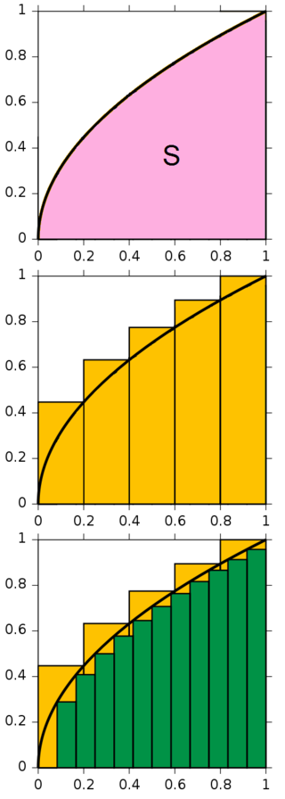
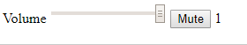

# Gliacloud Frontend Test

There are 6 questions you should answer:

- [Timer](#timer)
- [Multiples](#multiples)
- [Integration](#integration)
- [Event loop](#event-loop)
- [Volume bar](#volume-bar)
- [Swinging boxes](#swinging-boxes)

Information about [project setup](#project-setup) is listed after the questions.

We have prepared all the templates you will need in this repository.

All you have to do is to modify the code in the directory `src/answers`,
and you should only modify the code at the designated positions.

## Important Notes

### Version

We built this repository with

- node v8.12.0
- npm v6.5.0


## Questions

### Timer

Please build a timer that:

- displays in `hh:mm:ss` format
- with `start`, `pause` and `stop` functions
- with vanilla js (without third party package) only.

Write your answer in `1-timer.js`

### Multiples

If we list all the natural numbers below 10 that are multiples of 3 or 5, we get 3, 5, 6 and 9. The sum of these multiples is 23.

- Find the sum of all the multiples of 3 or 5 below 1000.
- Try to implement it in the most efficient way.

Write your answer in `2-multiples.js`

### Integration

The following image describes the integral approximation steps.



We will implement an definite integration function.

Please try to add 1~3 lines of code in `3-integration.js` to finish the integration.

### Event Loop

An asynchronous runner is presented in `4-event-loop.js`.

Please try to insert the following 3 lines

```javascript
await Promise.resolve()
```

```javascript
this.dispatch()
```

```javascript
this.plays[0]()
```

to their appropriate positions in the `run` method

so that the log output will be in the order

```
run 0
play 0 0
play 1 0
play 0 1
run 1
play 0 2
run 2
play 1 1
```

### Volume Bar

Create a volume bar using Vue that satisfies the following:



1. When volume value is changed by sliding, the volume in store should be updated to that value.
2. Clicking Mute button should set both the volume bar display value and store volume to 0.
3. When muted, clicking Unmute should restore both the volume bar display value and store volume to the value at step 1.

Try to achieve the functionalities in `5-volume-bar.vue` **without modifying the template**.

### Swinging Boxes

A set of swinging boxes are shown in `6-swinging-boxes.vue`.

Try to improve performance of this animation through **adjusting a few lines of the css**.

## Project setup
```
npm install
```

### Compiles and hot-reloads for development
```
npm run serve
```

### Compiles and minifies for production
```
npm run build
```

### Lints and fixes files
```
npm run lint
```
